## About Me

Ex OSCP-certified cybersecurity consultant, I currently work as a freelance software engineer. I work primarily with Rust and Flutter.

Portfolio: <a href="https://portfolio.valdum.dev">portfolio.valdum.dev</a>

If you want to contact me for a freelancing mission, feel free to email me at <a href="mailto:freelance@mail.valdum.dev">freelance@mail.valdum.dev</a>

Have fun browsing my projects !

## Main Skills
 

  <!-- RUST -->
  

    
  

  <ul>
    <li>Axum, Tokio, Serde</li>
    <li>Leptos</li>
    <li>SQLx</li>
  </ul>

   
    
  <!-- FLUTTER -->
  

    
  

  <ul>
    <li>Riverpod, Riverpod Generator</li>
    <li>Dio, GoRouter</li>
    <li>Json Annotation, Freezed</li>
  </ul>

 
 

<!-- GRAPH -->

